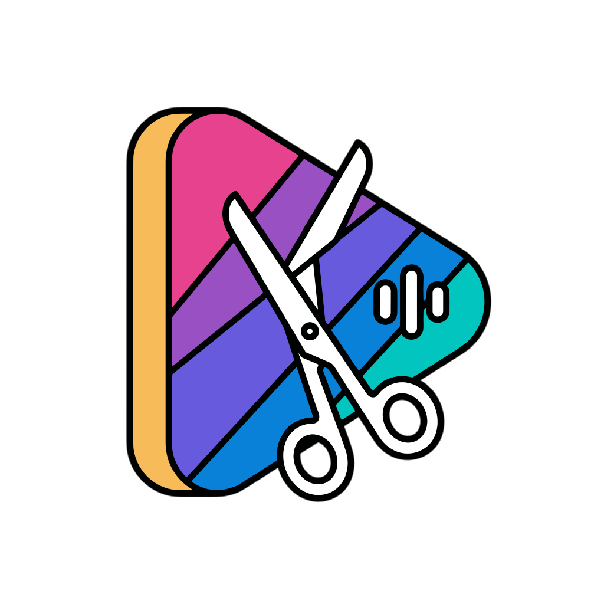

<a id="readme-top"></a>

<div align="center">
  

  <h1>ClippyMe</h1>

  <p><b>Self-hosted AI pipeline that turns long videos (YouTube or upload) into viral 9:16 vertical shorts.</b></p>

  <p>
    
    
    
    
    
    
  </p>

  <p>
    <a href="#quick-start-docker">Quick start</a> ·
    <a href="#configuration">Configuration</a> ·
    <a href="#api">API</a> ·
    <a href="#security-posture">Security</a> ·
    <a href="https://github.com/fralapo/clippyme/issues">Report a bug</a>
  </p>
</div>

Fork of OpenShorts, hardened and extended: cloud-or-local transcription, Gemini viral-moment detection, active-speaker 9:16 reframing, compose-on-download editing, and one-click multi-platform scheduling.

> Status: personal/self-hosted project. Safe to run on a trusted LAN. **Do not expose port 8000 to the public internet** without adding an authentication layer in front of it.

<details>
<summary><b>Table of contents</b></summary>

- [What it does](#what-it-does)
- [Stack](#stack)
- [Quick start (Docker)](#quick-start-docker)
- [Local development (no Docker)](#local-development-no-docker)
- [Configuration](#configuration)
- [Repository layout](#repository-layout)
- [API](#api)
- [Editing toggles (compose-on-download)](#editing-toggles-compose-on-download)
- [Reframing](#reframing)
- [Publishing (Zernio)](#publishing-zernio)
- [Security posture](#security-posture)
- [CPU vs GPU](#cpu-vs-gpu)
- [Acknowledgements](#acknowledgements)

</details>

---

## What it does

Given a video URL or upload, ClippyMe runs the following pipeline end-to-end:

1. **Download** with `yt-dlp` (Deno-based JS runtime to bypass YouTube bot detection, optional cookies for age-gated content).
2. **Transcribe** with **Deepgram Nova-3** by default (multi-language, code-switching EN/IT) — automatic fallback to local **Faster-Whisper** if no key or network failure. Cached on disk for 7 days keyed by URL hash.
3. **Detect viral moments** with **Google Gemini**. A 5-axis viral_score rubric (HOOK_STRENGTH, EMOTIONAL_PAYOFF, QUOTABILITY, SELF_CONTAINED, DENSITY) plus a 5-level robust JSON parser tolerates malformed model output.
4. **Reframe to 9:16** with active-speaker tracking: YOLOv8 person detection + MediaPipe FaceMesh mouth-aspect-ratio (MAR) variance to pick who is speaking, then a smoothed cameraman that adapts speed and zoom per scene. Hardened against messy real-world inputs: variable-frame-rate normalization, audio `start_time` compensation (YouTube A/V desync), and corrupt-frame resilience — all no-ops on clean sources.
5. **Post-process** each clip: Ken Burns auto-zoom (1.0→1.05×), EBU R128 audio normalization to −14 LUFS, automatic cover frame selection.
6. **Optional editing** at download time (compose-on-demand): **Smart Cut** (filler-word + silence removal via auto-editor v3 timeline + audio polish), **Hook** text overlay (Pillow + emoji), **Subtitles** (6 ASS karaoke presets or classic SRT, pixel-faithful frontend preview).
7. **Publish or schedule** to TikTok / Instagram / YouTube via **Zernio**, with a SmartScheduler that picks Italian-prime-time slots, avoids same-day collisions, and handles per-platform daily-limit 429s by skipping exhausted platforms across a batch.

---

## Stack

| Layer | Tech |
|---|---|
| Backend | Python 3.11, FastAPI, Pydantic v2, asyncio queue |
| Pipeline | yt-dlp · Deepgram REST · Faster-Whisper · PySceneDetect · YOLOv8 (Ultralytics) · MediaPipe · ffmpeg · auto-editor (Nim binary) · Pillow |
| AI | Google Gemini (viral detection) · Deepgram Nova-3 (transcription) |
| Frontend | React 18 · Vite 5 · Tailwind CSS v4 · shadcn/ui · Radix · sonner |
| Publishing | Zernio multi-platform API |
| Deploy | Docker Compose (CPU multi-arch + optional NVIDIA GPU profile) |

---

## Quick start (Docker)

```bash
git clone https://github.com/fralapo/clippyme.git
cd clippyme
docker compose up --build
```

- Backend: http://localhost:8000
- Frontend: http://localhost:5175

Open the dashboard, drop in a YouTube URL or upload a file, and watch the pipeline run live.

> **First run after a pull** that touches `requirements.txt` or `package.json`: `docker compose down -v && docker compose up --build` to clear the stale anonymous volume on `/app/node_modules`.

### NVIDIA GPU profile

```bash
docker compose -f docker-compose.yml -f docker-compose.gpu.yml up --build
```

---

## Local development (no Docker)

```bash
# Backend
pip install -r requirements.txt
pip install -e .                                       # registers the clippyme src-layout package
python -m uvicorn clippyme.api.app:app --reload --port 8000

# Frontend (separate terminal)
cd dashboard && npm install && npm run dev

# Pipeline CLI (one-shot, no API)
python -m clippyme.pipeline.main <url_or_path> [--instructions "focus on hooks"] \
                                                [--reframe-mode auto|disabled] \
                                                [--no-zoom]
```

---

## Configuration

All API keys, model selection, and cookies are managed **from the dashboard Settings tab** and persisted to `data/config.json` (mode `0600`, git-ignored). No `.env` file required.

| Key | Required for | Notes |
|---|---|---|
| `GEMINI_API_KEY` | Viral moment detection | Set the model from the dropdown (Flash / Pro). |
| `DEEPGRAM_API_KEY` | Cloud transcription (default) | Falls back to local Faster-Whisper if missing. |
| `HUGGINGFACE_TOKEN` | Optional gated models for Whisper | |
| Zernio | Social publishing | Per-platform account IDs auto-discovered via "Discover from Zernio". |
| Cookies | YouTube age-gated / region-locked content | Upload a Netscape `cookies.txt` from the Settings tab. Stored at `data/cookies.txt`, mode `0600`, max 10 MB. |

Runtime env overrides (rarely needed):

| Variable | Default | Purpose |
|---|---|---|
| `TRANSCRIPTION_PROVIDER` | `deepgram` | Or `whisper` to force local. |
| `DEEPGRAM_MODEL` | `nova-3` | |
| `DEEPGRAM_LANGUAGE` | `multi` | |
| `ZERNIO_DEFAULT_TZ` | `Europe/Rome` | |
| `ZERNIO_MIN_GAP_SECONDS` | `5400` | SmartScheduler min spacing between posts. |
| `REFRAME_SMOOTHER` | _(blank)_ | `euro` switches the speaker camera to the 1€ adaptive filter; blank keeps the two-speed EMA. |
| `REFRAME_LOST_HOLD` | `90` | Frames a lost subject is held before the camera drifts back to center (~3 s @ 30 fps). |
| `REFRAME_LOST_DRIFT` | `0.05` | Per-frame ease rate of the drift-to-center recovery. |
| `REFRAME_EURO_MINCUTOFF` / `REFRAME_EURO_BETA` | `0.014` / `0.0008` | 1€ smoother tuning (only when `REFRAME_SMOOTHER=euro`): smoothness floor / speed responsiveness. |

---

## Repository layout

Backend uses an **`src/`-layout** Python package; frontend is a separate Vite app. Tests live at the root.

```
src/clippyme/
  api/                FastAPI surface
    app.py            App factory, lifespan, all HTTP endpoints
    schemas.py        Pydantic request models (strict validation)
    security.py       Trusted-origin checks, job-id UUID4 validation
  pipeline/           Heavy lifters
    main.py           CLI orchestrator: download → transcribe → Gemini → reframe → postprocess
    deepgram_transcribe.py   Deepgram Nova-3 REST client (retry/backoff, keyterms)
    gemini_parser.py  5-level JSON parsing chain + Pydantic validation + dedupe
    gemini_service.py List available Gemini models
    reframe.py        cv2/YOLO/MediaPipe glue: SpeakerTracker + SmoothedCameraman
    reframe_ops.py    Pure decision math (no cv2 → host-tested): smoothers, zoom
    media_probe.py    cv2-free ffprobe + A/V-sync helpers (VFR, start_time, fps)
  domain/             Endpoint-facing business logic
    compose.py        Smart Cut → Hook → Subtitles compose pipeline
    clip_endpoints.py        Smart Cut + history restore helpers
    job_results.py    Worker loop result loaders + main.py command builder (whitelisted)
    job_artifacts.py  Filesystem helpers for job outputs
    job_worker.py     Async queue workers + log enqueue
    history_service.py       Disk-backed job history scan
    smartcut.py       Two-stage filler-word + audio polish (auto-editor v3 timeline)
    subtitles.py      ASS karaoke (6 presets) + SRT + ffmpeg burn (filtergraph-escape hardened)
    hooks.py          Text overlay with Pillow + NotoColorEmoji
  integrations/       External clients
    social_publisher.py      Zernio REST + SmartScheduler + publish_clip orchestrator
    auto_editor_updater.py   Background daily updater for the auto-editor binary
  storage/
    config_store.py   data/config.json read/write (mode 0600)

dashboard/
  src/
    App.jsx                 Top-level orchestrator (≈270 lines)
    hooks/                  useJobSubmission, useJobPolling, useHistory,
                            useSessionPersistence, useBackendStatus, useClipStates
    components/             MediaInput, ResultCard, ResultsGrid, SubtitleModal,
                            HookModal, PublishModal, BatchPublishModal, SettingsTab,
                            ZernioSettings, ProcessingView, HistoryTab, …
    components/ui/          shadcn/ui primitives (Button, Dialog, Tabs, Tooltip, …)
    lib/subtitlePresets.js  1:1 mirror of subtitles.py SUBTITLE_PRESETS for the live preview

fonts/                Bundled TTF fonts served via /fonts (subtitle + hook rendering)
data/                 Persisted config, cookies, transcript cache (git-ignored)
```

---

## API

All routes are JSON in / JSON out. Job IDs are strict UUID4. Config endpoints require a trusted-origin client (loopback or RFC1918).

| Method | Path | Purpose |
|---|---|---|
| `POST` | `/api/process` | Single video (URL or upload). Accepts `reframe_mode`. |
| `POST` | `/api/batch` | Up to 20 URLs in one shot. |
| `GET` | `/api/status/{job_id}` | Live status + logs + result. |
| `POST` | `/api/cancel/{job_id}` | Kill the subprocess. |
| `POST` | `/api/compose/{job_id}/{clip_index}` | Compose Smart Cut + Hook + Subtitles on demand. |
| `POST` | `/api/smartcut/{job_id}/{clip_index}` | Smart Cut a single clip. |
| `POST` | `/api/reframe/{job_id}/{clip_index}` | Switch a clip's reframe mode. |
| `GET` | `/api/history` | Past jobs from disk. |
| `POST` | `/api/history/{job_id}/restore` | Reload a past job into memory. |
| `DELETE` | `/api/history/{job_id}` | Delete from disk. |
| `GET` | `/api/config/models` | List Gemini models (trusted origin). |
| `POST` | `/api/config` | Persist API keys (trusted origin). |
| `POST` | `/api/config/cookies` | Upload Netscape cookies file (trusted origin, 10 MB cap). |
| `GET` | `/api/config/cookies/status` | Is a cookie file present? |
| `DELETE` | `/api/config/cookies` | Remove the cookies file. |
| `GET` | `/api/config/zernio` | Masked Zernio config. |
| `POST` | `/api/config/zernio` | Save/update Zernio credentials. |
| `GET` | `/api/zernio/accounts` | Discover accounts via Zernio. |
| `POST` | `/api/publish/{job_id}/{clip_index}` | Upload + schedule a clip on TikTok/IG/YouTube. |

Static mounts: `/videos`, `/thumbnails`, `/gallery`, `/video`, `/fonts` (read-only).

<p align="right">(<a href="#readme-top">back to top</a>)</p>

---

## Editing toggles (compose-on-download)

Each generated clip exposes three independent toggles in the UI:

- **Smart Cut** — removes silences and filler words via auto-editor v3 timeline; falls back to ffmpeg concat demuxer if the binary is missing.
- **Hook** — text overlay with configurable position/size, auto-prefilled from the Gemini hook suggestion. Supports emoji.
- **Subtitles** — 6 viral karaoke presets (`classic_white`, `hormozi_bold`, `neon_glow`, `mrbeast_box`, `minimal_clean`, `fire_impact`) or classic SRT with font/color/position controls. The frontend preview is **pixel-faithful** with the burned-in output (`dashboard/src/lib/subtitlePresets.js` mirrors the Python preset table 1:1 — keep them in sync).

Toggling is UI-only state. Nothing is processed on click. At download time the active toggles + parameters are sent to `/api/compose/{job_id}/{clip_index}` and the layers are composed in one pass: Smart Cut → Hook → Subtitles.

---

## Reframing

Three per-scene strategies, decided by sampling 7 frames per scene:

- **TRACK** — single speaker → active-speaker tracking via `SpeakerTracker` (MAR variance + face size) and `SmoothedCameraman` (adaptive smoothing slow/fast, X+Y axis tracking, dynamic 1.0–1.6× zoom).
- **WIDE** — multi-speaker → same tracker with longer cooldown (45 frames ≈ 1.5 s) for interview-style switching.
- **GENERAL** — no faces → letterbox.

**Lost-subject recovery:** in TRACK/WIDE, if no speaker is detected for `REFRAME_LOST_HOLD` frames (~3 s) the camera eases back to the source center and gently zooms out instead of freezing on empty space. The active-speaker camera can optionally use a 1€ adaptive filter (`REFRAME_SMOOTHER=euro`) or a momentum/damped-spring smoother (`REFRAME_SMOOTHER=spring`) in place of the default two-speed EMA, with an optional hard pan-rate cap (`REFRAME_MAX_STEP_PX`). An opt-in two-pass global trajectory smoother (`REFRAME_GLOBAL_SMOOTH=1`, method `savgol`/`kalman`/`l2`) Savitzky-Golay-smooths the whole camera path per scene. The pure decision math lives in the cv2-free, host-tested `clippyme.pipeline.reframe_ops` module; ffprobe-backed A/V-sync helpers (VFR detection, stream `start_time`, fps reconcile) live alongside in `media_probe.py`.

Override per job: `--reframe-mode disabled` forces a 4:3 center crop with black bars.

After a job completes, every clip can be flipped between `auto` and `disabled` post-hoc via `POST /api/reframe/{job_id}/{clip_index}`. The original 16:9 source slice is preserved as `source_<clip>.mp4` to make this latency-tolerant. Legacy jobs without the preserved slice return HTTP 409.

---

## Publishing (Zernio)

`POST /api/publish/{job_id}/{clip_index}` uploads the clip to Zernio's presigned URL and schedules a post. Three scheduling modes:

- `now` — immediate
- `auto` — `SmartScheduler` picks the next free Italian-prime-time slot per weekday, with a 90-minute minimum gap and anti-collision against already-scheduled posts (3-step algorithm: free prime-time window → 15-min scan 07–23 → fallback)
- `manual` — caller passes an ISO 8601 `scheduled_for`

The dashboard `BatchPublishModal` publishes every eligible clip in one click. With `auto` it can spread one clip per day from a chosen start date (mirroring the original `tmp/programma_shorts.py` logic), and gracefully skips platforms that hit Zernio's daily limit (HTTP 429) without failing the whole batch.

---

## Security posture

This project has been audited; the current state is suitable for **trusted LAN deployment**. Notable hardening already in place:

- Strict UUID4 validation on every `{job_id}` path parameter.
- Trusted-origin guard on every config-mutation endpoint (cookies upload, Gemini key probe, Zernio config).
- Pydantic patterns on all subtitle / hook fields (font name, hex colors, file names) to prevent FFmpeg filtergraph injection.
- `_ffmpeg_filter_escape()` covers `\\ : ' , ; [ ]` and is re-applied even on direct internal callers.
- Subprocess calls use list-form argv with whitelisted `reframe_mode` and bounded `instructions` length — no shell interpolation.
- Uploaded media files are saved with a server-generated name (extension whitelisted) — the client-supplied filename is discarded.
- `data/config.json` and `data/cookies.txt` are written with mode `0600`.
- Internal exceptions never leak `str(e)` to API clients; full stack traces are logged server-side only.
- `ZERNIO_BASE_URL` env override is allowlisted to `https://*.zernio.com`.

**Not yet in place** (required before exposing publicly): authentication layer, rate limiting, CSRF, full reverse proxy with TLS + security headers.

<p align="right">(<a href="#readme-top">back to top</a>)</p>

---

## CPU vs GPU

The CPU image runs everywhere (Linux x86_64, ARM64, Apple Silicon via Docker Desktop). Faster-Whisper falls back to CPU automatically and YOLOv8 uses the CPU path. The NVIDIA profile adds CUDA wheels for `torch`, `nvidia-cublas-cu12`, and the cuDNN runtime — expect a ~500 MB image-size overhead.

---

## Acknowledgements

- [OpenShorts](https://github.com/SamurAIGPT/Open-Source-Shorts-Maker) — original starting point.
- [yt-dlp](https://github.com/yt-dlp/yt-dlp), [Faster-Whisper](https://github.com/SYSTRAN/faster-whisper), [Deepgram](https://deepgram.com), [Google Gemini](https://ai.google.dev), [Ultralytics YOLO](https://github.com/ultralytics/ultralytics), [MediaPipe](https://github.com/google/mediapipe), [auto-editor](https://github.com/WyattBlue/auto-editor), [Zernio](https://zernio.com).
- [shadcn/ui](https://ui.shadcn.com), [Radix UI](https://www.radix-ui.com), [Tailwind CSS](https://tailwindcss.com).
- Reframe-algorithm research studied and selectively ported (see `docs/*-analysis.md`): [gauravzazz/smart-reframe](https://github.com/gauravzazz/smart-reframe), [KazKozDev/auto-vertical-reframe](https://github.com/KazKozDev/auto-vertical-reframe), [obi19999/smart-video-reframe](https://github.com/obi19999/smart-video-reframe), [mfahsold/montage-ai](https://github.com/mfahsold/montage-ai), [kamilstanuch/Autocrop-vertical](https://github.com/kamilstanuch/Autocrop-vertical).
